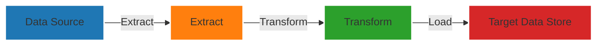
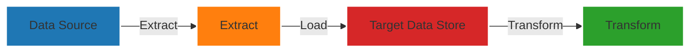

# Core Data Concepts and Analytics Workload on Azure: Sample Questions and Answers 

Costa Rica

[](https://github.com/)
[brown9804](https://github.com/brown9804)

Last updated: 2025-01-16

----------

> [!NOTE]
> The questions and answers provided in this study guide are for practice purposes only and are not official practice questions.
> They are intended to help you prepare for the [DP-900 Microsoft certification exam](https://learn.microsoft.com/en-us/credentials/certifications/resources/study-guides/dp-900).
> For additional preparation materials and the most up-to-date information, please refer to the [official Microsoft documentation](https://learn.microsoft.com/en-us/credentials/certifications/azure-data-fundamentals/?practice-assessment-type=certification).

- Describe core data concepts
- Describe an analytics workload on Azure

<details>
<summary><b>List of References </b> (Click to expand)</summary>

- [Describe core concepts of data modeling](https://learn.microsoft.com/en-us/training/modules/explore-fundamentals-data-visualization/3-data-modeling)
- [Dedicated SQL pool (formerly SQL DW) architecture in Azure Synapse Analytics](https://learn.microsoft.com/en-us/azure/synapse-analytics/sql-data-warehouse/massively-parallel-processing-mpp-architecture)
- [Extract, transform, and load (ETL)](https://learn.microsoft.com/en-us/azure/architecture/data-guide/relational-data/etl)
- [Azure Storage redundancy](https://learn.microsoft.com/en-us/azure/storage/common/storage-redundancy)
- [Use geo-redundancy to design highly available applications](https://learn.microsoft.com/en-us/azure/storage/common/geo-redundant-design)
- [What is Power BI?](https://learn.microsoft.com/en-us/power-bi/fundamentals/power-bi-overview)
- [What is Azure Data Studio?](https://learn.microsoft.com/en-us/azure-data-studio/what-is-azure-data-studio)
- [Install Azure PowerShell](https://learn.microsoft.com/en-us/powershell/azure/install-az-ps?view=azps-0.10.0)
- [Get started with Azure CLI](https://learn.microsoft.com/en-us/cli/azure/get-started-with-azure-cli)

</details>

<details>
<summary><b>List of questions/answers </b> (Click to expand)</summary>

- [Q1: Understanding Descriptive Analytics](#q1-understanding-descriptive-analytics)
- [Q2: Understanding Batch Processing](#q2-understanding-batch-processing)
- [Q3: Understanding Predictive Analytics](#q3-understanding-predictive-analytics)
- [Q4: Understanding Types of Analytics](#q4-understanding-types-of-analytics)
- [Q5: Understanding Diagnostic Analytics](#q5-understanding-diagnostic-analytics)
- [Q6: Understanding Cognitive Analytics](#q6-understanding-cognitive-analytics)
- [Q7: Understanding Prescriptive Analytics](#q7-understanding-prescriptive-analytics)
- [Q8: Understanding Types of Analytics](#q8-understanding-types-of-analytics)
- [Q9: Understanding Database Normalization](#q9-understanding-database-normalization)
- [Q10: Understanding ETL Process Requirements](#q10-understanding-etl-process-requirements)
- [Q11: Understanding ELT Process Requirements](#q11-understanding-elt-process-requirements)
- [Q12: Understanding JSON Structure](#q12-understanding-json-structure)
- [Q13: Understanding Azure Synapse Analytics MPP Engine](#q13-understanding-azure-synapse-analytics-mpp-engine)
- [Q14: Understanding Database Types](#q14-understanding-database-types)
- [Q15: Understanding Database Scalability](#q15-understanding-database-scalability)
- [Q16: Understanding Database Schema Flexibility](#q16-understanding-database-schema-flexibility)
- [Q17: Understanding Transaction Support](#q17-understanding-transaction-support)
- [Q18: Understanding Use Cases](#q18-understanding-use-cases)
- [Q19: Understanding ELT Process Stages](#q19-understanding-elt-process-stages)
- [Q20: Understanding ELT Process Stages](#q20-understanding-elt-process-stages)
- [Q21: Understanding ELT Process Stages](#q21-understanding-elt-process-stages)
- [Q22: Understanding ELT Process Stages](#q22-understanding-elt-process-stages)
- [Q23: Understanding ELT Process Stages](#q23-understanding-elt-process-stages)
- [Q24: Choosing the Right Visualization](#q24-choosing-the-right-visualization)
- [Q25: Choosing the Right Visualization](#q25-choosing-the-right-visualization)
- [Q26: Choosing the Right Visualization](#q26-choosing-the-right-visualization)
- [Q27: Choosing the Right Visualization](#q27-choosing-the-right-visualization)
- [Q28: Understanding Redundancy Options](#q28-understanding-redundancy-options)
- [Q29: Understanding Redundancy Options](#q29-understanding-redundancy-options)
- [Q30: Choosing the Right Visualization](#q30-choosing-the-right-visualization)
- [Q31: Understanding Redundancy Options](#q31-understanding-redundancy-options)
- [Q32: Understanding PaaS Database Offerings](#q32-understanding-paas-database-offerings)
- [Q33: Understanding PaaS and IaaS Database Offerings](#q33-understanding-paas-and-iaas-database-offerings)
- [Q34: Understanding Azure Resource Manager Templates](#q34-understanding-azure-resource-manager-templates)
- [Q35: Understanding IaaS Database Offerings](#q35-understanding-iaas-database-offerings)
- [Q36: Understanding Data Warehousing](#q36-understanding-data-warehousing)
- [Q37: Understanding Data Lakes](#q37-understanding-data-lakes)
- [Q38: Understanding ETL Processes](#q38-understanding-etl-processes)
- [Q39: Understanding Azure Resource Manager Templates](#q39-understanding-azure-resource-manager-templates)
- [Q40: Understanding Data Governance](#q40-understanding-data-governance)
- [Q41: Understanding Data Integration](#q41-understanding-data-integration)
- [Q42: Understanding Azure Resource Manager Templates](#q42-understanding-azure-resource-manager-templates)
- [Q43: Understanding ETL and ELT Processes](#q43-understanding-etl-and-elt-processes)
- [Q44: Understanding Azure Service Models](#q44-understanding-azure-service-models)
- [Q45: Understanding Azure Service Models](#q45-understanding-azure-service-models)
- [Q46: Understanding Azure Service Models](#q46-understanding-azure-service-models)
- [Q47: Understanding Azure Resource Manager Templates](#q47-understanding-azure-resource-manager-templates)
- [Q48: Understanding Azure Service Models](#q48-understanding-azure-service-models)
- [Q49: Understanding Azure Service Models](#q49-understanding-azure-service-models)
- [Q50: Understanding Azure SQL Managed Instance](#q50-understanding-azure-sql-managed-instance)
- [Q51: Understanding Azure Resource Manager Templates](#q51-understanding-azure-resource-manager-templates)
- [Q52: Understanding Azure SQL Managed Instance](#q52-understanding-azure-sql-managed-instance)
- [Q53: Understanding Azure SQL Database](#q53-understanding-azure-sql-database)
- [Q54: Understanding Elastic Pools](#q54-understanding-elastic-pools)

</details>

> [!TIP]
> Data Science and Analytics roles: 

| Role            | Description                                                                 |
|-----------------|-----------------------------------------------------------------------------|
| Data Analyst    | Responsible for identifying which business rules must be applied to the data of a company. Analyzes data to provide actionable insights and support decision-making. |
| Data Engineer   | Designs, builds, and maintains the infrastructure and architecture for data generation, storage, and processing. Ensures data is accessible, reliable, and efficiently processed. |
| Data Scientist  | Uses advanced analytical techniques, machine learning, and statistical methods to extract insights from data. Develops predictive models and algorithms to solve complex business problems. |


> [!TIP]
> Data structures examples:

| Data Structure     | Examples                          |
|--------------------|-----------------------------------|
| Unstructured       | Text documents, Images, Videos    |
| Semi-Structured    | JSON, XML, HTML                   |
| Structured         | SQL Databases, Spreadsheets       |

> [!TIP]
>  Concepts:

| Concept          | Description                                                                 |
|------------------|-----------------------------------------------------------------------------|
| Index            | A database object that improves the speed of data retrieval operations on a table by providing quick access to rows. |
| View             | A virtual table based on the result set of an SQL query. It does not store data itself but provides a way to look at data from one or more tables. |
| Scalar Function  | A function that returns a single value, typically used to perform calculations or operations on data. |
| Table            | A database object that stores data in rows and columns, forming the basic structure of a relational database. |

> [!TIP]
> Service model: 

| Service Model                | Abbreviation | Description                                                                 | Examples                          |
|------------------------------|--------------|-----------------------------------------------------------------------------|-----------------------------------|
| Infrastructure as a Service  | IaaS         | Provides virtualized computing resources over the internet. Users manage operating systems, applications, and middleware. | Microsoft Azure                   |
| Platform as a Service        | PaaS         | Provides a platform allowing customers to develop, run, and manage applications without dealing with the underlying infrastructure. | Microsoft Azure App Service       |
| Software as a Service        | SaaS         | Delivers software applications over the internet, on a subscription basis. Users access the software via a web browser. | Microsoft Office 365              |
| Function as a Service        | FaaS         | Provides a platform for users to develop, run, and manage application functionalities without managing the infrastructure. | Azure Functions                   |
| Backend as a Service         | BaaS         | Provides backend cloud storage and computing services for mobile and web applications. | Azure Mobile Apps                 |
| Database as a Service        | DBaaS        | Provides database management and maintenance services over the cloud. | Azure SQL Database                |

> [!TIP]
> Types and descriptions:

| Type of Analytics | Description |
|-------------------|-------------|
| Descriptive       | Summarizes past data to understand `what has happened`. → `What happened?` |
| Diagnostic        | Analyzes data to understand `why something happened`. → `Why did it happen?`|
| Prescriptive      | Provides `recommendations` for actions based on data analysis. → `What should I do?`|
| Predictive        | Uses historical data to `predict future outcomes`. |
| Real-time         | Analyzes data as it is generated to provide `immediate insights`. |
| Cognitive         | Uses AI and machine learning to `simulate human` thought processes in data analysis. |

> [!TIP]
> Types of Storage:

| Storage Option            | Description                                                                 |
|---------------------------|-----------------------------------------------------------------------------|
| Azure Blob Storage        | Massively scalable object storage for unstructured data, such as text or binary data. Ideal for cloud-native workloads, archives, data lakes, and high-performance computing. |
| Azure File Storage        | Provides fully managed file shares in the cloud that are accessible via the SMB protocol. Suitable for replacing or supplementing on-premises file servers. |
| Azure Disk Storage        | High-performance, durable block storage for Azure virtual machines. Supports both HDD and SSD options. |
| Azure Data Lake Storage   | Combines the scalability and cost benefits of Azure Blob Storage with a hierarchical file system, optimized for big data analytics workloads. |
| Azure NetApp Files        | Enterprise-grade file storage service with support for NFS and SMB protocols, providing high performance and advanced data management features. |
| Azure Archive Storage     | Low-cost storage option for data that is rarely accessed, with high durability and security. Ideal for long-term retention and archival storage. |
| Azure Managed Disks       | Simplifies disk management for Azure VMs by handling storage account creation and management. Supports both standard and premium disks. |
| Azure Elastic SAN         | A cloud-native Storage Area Network (SAN) service that provides end-to-end experience similar to on-premises SANs. |
| Azure File Sync           | Extends on-premises file servers to Azure, providing centralized file share management and cloud tiering. |
| Azure Data Box            | A physical device that helps transfer large amounts of data to Azure quickly and securely. Suitable for offline data transfer. |

> [!TIP]
> Redundancy options:

| Storage Option                        | Abbreviation | Description                                                                 |
|---------------------------------------|--------------|-----------------------------------------------------------------------------|
| Zone-Redundant Storage                | ZRS          | Replicates data synchronously across three Azure availability zones in the primary region, providing high availability and durability. |
| Read-Access Geo-Redundant Storage     | RA-GRS       | Replicates data to a secondary region asynchronously, allowing read access to the replicated data in the secondary region during an outage in the primary region. |
| Locally-Redundant Storage             | LRS          | Replicates data synchronously within a single data center in the primary region, offering a lower-cost option with moderate availability and durability. |
| Geo-Redundant Storage                 | GRS          | Replicates data to a secondary region asynchronously, providing protection against regional outages but without read access to the secondary region unless a failover occurs. |

> [!TIP]
> Data Schema and Terms:

| Term                | Description                                                                 |
|---------------------|-----------------------------------------------------------------------------|
| Transactional Model | A database model designed to manage transactions, ensuring data integrity and consistency. |
| Star Schema         | A type of database schema that organizes data into fact and dimension tables, with the fact table at the center connected to dimension tables like a star. |
| Snowflake Schema    | A more complex type of database schema that normalizes dimension tables into multiple related tables, resembling a snowflake shape. |
| Fact                | A table in a database schema that contains quantitative data for analysis, often linked to dimension tables. |
| Dimension           | A table in a database schema that contains descriptive attributes related to the facts, used for filtering and grouping data. |
| Bridge              | A table used to handle many-to-many relationships between fact and dimension tables in a database schema. |

> [!TIP]
> Nested structures:

```json
{
  "employee": {
    "first_name": "Jane",
    "last_name": "Doe",
    "address": {
      "line_1": "123 Main St",
      "line_2": "Suite 400",
      "city": "Los Angeles",
      "state": "CA",
      "ZIP_code": "90001"
    },
    "contacts": [
      {
        "type": "email",
        "value": "jane.doe@example.com"
      },
      {
        "type": "phone",
        "value": "555-123-4567"
      }
    ],
    "projects": [
      {
        "name": "Project Alpha",
        "role": "Lead Developer"
      },
      {
        "name": "Project Beta",
        "role": "Consultant"
      }
    ]
  }
}
```

| Term            | Description                                                                 | Example                                                                 |
|-----------------|-----------------------------------------------------------------------------|-------------------------------------------------------------------------|
| Root Object     | The top-level object in a hierarchy, not contained within any other object. | `{ "employee": { ... } }`                                               |
| Nested Object   | An object that is contained within another object.                          | `"address": { "line_1": "123 Main St", "line_2": "Suite 400", "city": "Los Angeles", "state": "CA", "ZIP_code": "90001" }` |
| Nested Array    | An array that is contained within another array or object.                  | `"contacts": [ { "type": "email", "value": "jane.doe@example.com" }, { "type": "phone", "value": "555-123-4567" } ]` ➡️ [ ] |

> [!TIP]
> Synapse SQL architecture components, from [official Microsoft documentation](https://learn.microsoft.com/en-us/azure/synapse-analytics/sql-data-warehouse/massively-parallel-processing-mpp-architecture#synapse-sql-architecture-components)

<div align="center">
  
</div>

> [!TIP]
> Visualization type:

| Visualization Type | Description |
|--------------------|-------------|
| Area Chart | Displays quantitative data over time, emphasizing the magnitude of change. |
| Bar Chart | Represents data with rectangular bars, useful for comparing different categories. |
| Column Chart | Similar to bar charts but with vertical bars, ideal for showing data changes over time. |
| Line Chart | Shows trends over time by connecting data points with a continuous line. |
| Pie Chart | Represents data as slices of a pie, showing proportions of a whole. |
| Donut Chart | Similar to pie charts but with a hole in the center, useful for showing proportions. |
| Scatter Chart | Uses dots to represent values for two different numeric variables, showing the relationship between them. |
| Treemap | Displays hierarchical data as nested rectangles, useful for showing proportions within a hierarchy. |
| Key Influencer | Identifies key factors influencing a particular metric or outcome. |
| Waterfall Chart | Visualizes the cumulative effect of sequential positive and negative values. |
| Funnel Chart | Shows a process that has stages, with the values decreasing progressively. |
| Gauge Chart | Displays a single value within a range, often used for KPIs. |
| Map | Visualizes data geographically, useful for showing spatial distributions. |
| Matrix | Similar to a table but with the ability to display data in a pivot format. |
| Card | Displays a single fact or data point, often used for KPIs. |
| Multi-row Card | Displays multiple data points, one per row. |
| Combo Chart | Combines a column chart and a line chart to compare multiple measures. |
| Decomposition Tree | Visualizes data across multiple dimensions, allowing for drill-down analysis. |
| Histogram | Represents the distribution of numerical data, showing the frequency of data intervals. |
| Slicer | Provides a way to filter data in reports, making it easier to focus on specific data points. |
| KPI | Displays key performance indicators, showing progress towards a goal. |
| Ribbon Chart | Shows data over time, highlighting the ranking of different categories. |
| Stacked Bar Chart | Similar to bar charts but with segments stacked on top of each other, showing the contribution of each segment to the total. |
| Stacked Column Chart | Similar to column charts but with segments stacked on top of each other, showing the contribution of each segment to the total. |
| Bubble Chart | Similar to scatter charts but with an additional dimension represented by the size of the bubbles. |
| Heat Map | Uses color to represent data values, useful for showing data density or intensity. |
| Bullet Chart | Displays performance against a target, often used for KPIs. |
| Sparkline | A small, simple chart that provides a compact visual representation of data trends. |

> [!TIP]
> Relational and Non Relational critieria:

Relational Databases:
- When you need strong data integrity and ACID compliance.
- When your data structure is well-defined and unlikely to change frequently.
- When you need to perform complex queries and transactions.
- When your application requires strong relationships between data entities.

Non-Relational Databases:
- When you need to handle large volumes of unstructured or semi-structured data.
- When your data schema is flexible and may change frequently.
- When you need high-speed read/write operations and horizontal scalability.
- When your application involves real-time analytics, content management, or IoT data.


| Criteria                        | Relational Databases (SQL)                                      | Non-Relational Databases (NoSQL)                                  |
|---------------------------------|-----------------------------------------------------------------|-------------------------------------------------------------------|
| **Data Structure**              | Structured data with predefined schema                         | Unstructured or semi-structured data                              |
| **Schema Flexibility**          | Fixed schema, requires schema changes for modifications        | Flexible schema, easily accommodates changes                      |
| **Data Relationships**          | Strong relationships with foreign keys and joins               | Limited or no support for complex relationships                   |
| **Query Language**              | SQL (Structured Query Language)                                | Varies (e.g., JSON, XML, key-value pairs, graph queries)          |
| **Transaction Support**         | ACID (Atomicity, Consistency, Isolation, Durability) compliant | May support BASE (Basically Available, Soft state, Eventual consistency) |
| **Use Case Examples**           | Financial systems, ERP, CRM, inventory management              | Social networks, content management, IoT data, real-time analytics|
| **Scalability**                 | Vertical scaling (adding more power to existing hardware)      | Horizontal scaling (adding more servers)                          |
| **Performance**                 | Optimized for complex queries and transactions                 | Optimized for large volumes of data and high-speed read/write operations |
| **Consistency**                 | Strong consistency                                             | Eventual consistency (in some cases)                              |
| **Examples**                    | MySQL, PostgreSQL, Oracle, SQL Server                          | MongoDB, Cassandra, Redis, Couchbase, Neo4j                       |

> [!TIP]
> Power Bi Services:

| Service                | Purpose                                                                 |
|------------------------|-------------------------------------------------------------------------|
| Power BI Desktop       | A Windows desktop application used to connect to, transform, and visualize data. It allows users to `create reports and data models that can be shared with others.` |
| Power BI Phone App     | A `mobile application for iOS and Android devices` that allows users to view and interact with Power BI reports and dashboards on the go. |
| Power BI Service       | An online service (SaaS) that allows users to `consume, share, and collaborate` on Power BI reports and dashboards. It provides a cloud-based environment for hosting and managing Power BI content. |

> [!TIP]
>  Data tools and prpose:

| Tool                          | Purpose                                                                 |
|-------------------------------|-------------------------------------------------------------------------|
| Microsoft SQL Server Management Studio (SSMS) | An integrated environment for managing any SQL infrastructure, from SQL Server to Azure SQL Database. It provides tools to `configure, monitor, and administer instances of SQL Server and databases`. |
| Azure Data Studio             | A lightweight, cross-platform data management and development tool for data professionals. It provides a `modern editor experience with IntelliSense, code snippets, source control integration, and an integrated terminal.` |
| Azure CLI                     | A cross-platform `command-line tool to connect to Azure and execute administrative commands on Azure resources`. It allows the execution of commands through a terminal using interactive command-line prompts or a script. |
| Azure PowerShell              | An extension of Windows PowerShell that `allows users to manage Azure resources directly from the command line using cmdlets`. It enables the automation of tasks such as creating and managing virtual machines, storage accounts, and other Azure services. |
| Microsoft SQL Server Data Tools (SSDT) | A modern development tool for `building SQL Server relational databases`, databases in the cloud with Azure SQL Database, or even large-scale data warehouses using Analysis Services (AS), Integration Services (IS), and Reporting Services (RS). SSDT provides project templates for database design as well as tools for debugging T-SQL code. |

> [!TIP]
> Types of processing:

| Type of Processing               | Description                                                                 |
|----------------------------------|-----------------------------------------------------------------------------|
| Stream Processing                | Involves continuous ingestion and processing of data in real-time or near real-time. It allows for immediate analysis and action on data as it arrives. Suitable for applications like real-time analytics, fraud detection, and monitoring. |
| Batch Processing                 | Involves processing large volumes of data at scheduled intervals or in batches. It is suitable for tasks that do not require immediate processing, such as end-of-day reporting, data transformation, and payroll processing. |
| Online Analytical Processing (OLAP) | Involves performing complex queries and multidimensional analysis on large volumes of historical data. It is used for business intelligence, decision support, and data mining. OLAP systems are optimized for read-heavy operations and provide fast query performance. |
| Online Transaction Processing (OLTP) | Involves managing and processing high volumes of short, atomic transactions. OLTP systems are optimized for write-heavy operations and ensure data integrity and consistency. They are used for applications like online banking, order entry, and retail sales. |

## Q1: Understanding Descriptive Analytics

> Descriptive analytics tells you:

- [ ] what is most likely to occur in the future.
- [ ] what occurred in the past. ✅
- [ ] which actions you can perform to affect outcomes.
- [ ] why something occurred in the past.

## Q2: Understanding Batch Processing

> To complete the sentence, choose the correct option.

In batch processing:
- [ ] **data is inserted one record at a time.** ❌: `This is incorrect because batch processing typically involves processing multiple records at once, not one at a time.`
- [ ] **data is handled immediately as it arrives.** ❌: `This is incorrect because batch processing involves handling data in groups or batches, not in real-time.`
- [ ] **delays in processing results are acceptable.** ✅: `This is correct because batch processing can tolerate some delay in delivering results, as it processes data in batches rather than immediately.`
- [ ] **tasks must be executed sequentially.** ❌: `This is incorrect because batch processing can be parallelized to improve efficiency, rather than being limited to sequential execution.`

## Q3: Understanding Predictive Analytics

> Predictive analytics helps you:

- [ ] understand why something happened.
- [ ] summarize past data.
- [ ] predict future outcomes. ✅
- [ ] recommend actions to take.

## Q4: Understanding Types of Analytics

> To complete the sentence, select the appropriate option.

Analyzing customer feedback to determine the reasons for a drop in sales is an example of ______ analytics.

Options:
- [ ] **cognitive** ❌: `This is incorrect because cognitive analytics involves using AI and machine learning to simulate human thought processes.`
- [ ] **descriptive** ❌: `This is incorrect because descriptive analytics summarizes past data to understand what has happened.`
- [ ] **predictive** ❌: `This is incorrect because predictive analytics uses historical data to predict future outcomes.`
- [ ] **diagnostic** ✅: `This is correct because diagnostic analytics analyzes data to understand why something happened.`


## Q5: Understanding Diagnostic Analytics

> Diagnostic analytics is used to:

- [ ] summarize past data.
- [ ] understand why something happened. ✅
- [ ] predict future outcomes.
- [ ] recommend actions to take.

## Q6: Understanding Cognitive Analytics

> To complete the sentence, select the appropriate option.

Analyzing customer service chat logs to provide real-time sentiment analysis is an example of ______ analytics.

- [ ] **descriptive** ❌: `This is incorrect because descriptive analytics summarizes past data to understand what has happened.`
- [ ] **predictive** ❌: `This is incorrect because predictive analytics uses historical data to predict future outcomes.`
- [ ] **prescriptive** ❌: `This is incorrect because prescriptive analytics provides recommendations for actions based on data analysis.`
- [ ] **cognitive** ✅: `This is correct because cognitive analytics involves using AI and machine learning to simulate human thought processes and analyze unstructured data.`

## Q7: Understanding Prescriptive Analytics

> Prescriptive analytics provides:

- [ ] summaries of past data.
- [ ] reasons why something happened.
- [ ] predictions of future outcomes.
- [ ] recommendations for actions. ✅

## Q8: Understanding Types of Analytics

> You are working on a data project and need to choose the appropriate type of analytics for different scenarios. Match each scenario with the correct type of analytics: <br/>
> - Summarizing past sales data to understand trends. <br/>
> - Analyzing customer feedback to determine why sales dropped. <br/>
> - Predicting future sales based on historical data. <br/>
> - Recommending actions to increase future sales. <br/>

Which type of analytics should you use for each scenario?

- [ ] Descriptive, Diagnostic, Predictive, Prescriptive ❌: `This is incorrect because the order of analytics types does not match the scenarios provided.`
- [ ] Diagnostic, Descriptive, Predictive, Prescriptive ❌: `This is incorrect because the first two analytics types are not correctly matched with the scenarios.`
- [ ] Descriptive, Diagnostic, Prescriptive, Predictive ❌: `This is incorrect because the last two analytics types are not correctly matched with the scenarios.`
- [ ] Descriptive, Diagnostic, Predictive, Prescriptive ✅: `This is correct because Descriptive analytics summarizes past data, Diagnostic analytics analyzes reasons for past events, Predictive analytics forecasts future outcomes, and Prescriptive analytics recommends actions.`

## Q9: Understanding Database Normalization

> For each of the following statements about database normalization, select if the statement is correct.

- [ ] **Normalization involves organizing data to reduce redundancy.** ✅: `This is correct because one of the primary goals of normalization is to reduce data redundancy by organizing data into related tables.`
- [ ] **Normalizing a database can improve data integrity.** ✅: `This is correct because normalization helps maintain consistency and accuracy in the database, thereby improving data integrity.`
- [ ] **Normalization eliminates the need for relationships between tables.** ❌: `This is incorrect because normalization does not eliminate the need for relationships between tables; instead, it organizes data into related tables with defined relationships.`

## Q10: Understanding ETL Process Requirements



> To complete the sentence, select the appropriate option.

An extract, transform, and load (ETL) process requires:

- [ ] **a matching schema in the data source and the data target.** ❌: `This is incorrect because ETL processes do not necessarily require matching schemas between the source and target.`
- [ ] **a target data store powerful enough to transform data.** ❌: `This is incorrect because the transformation typically occurs in an intermediate staging area, not necessarily in the target data store.`
- [ ] **data that is fully processed before being loaded to the target data store.** ✅: `This is correct because ETL processes involve extracting data, transforming it as needed, and then loading the fully processed data into the target data store.`
- [ ] **that the data target be a relational database.** ❌: `This is incorrect because ETL processes can load data into various types of data stores, not just relational databases.`

## Q11: Understanding ELT Process Requirements



> To complete the sentence, select the appropriate option.

An extract, load, and transform (ELT) process requires:
- [ ] **a matching schema in the data source and the data target.** ❌: `This is incorrect because ELT processes do not necessarily require matching schemas between the source and target.`
- [ ] **a target data store powerful enough to transform data.** ✅: `This is correct because in ELT processes, the transformation occurs after the data is loaded into the target data store, which needs to be powerful enough to handle the transformation.`
- [ ] **data that is fully processed before being loaded to the target data store.** ❌: `This is incorrect because in ELT processes, data is loaded into the target data store before being transformed.`
- [ ] **that the data target be a relational database.** ❌: `This is incorrect because ELT processes can load data into various types of data stores, not just relational databases.`

## Q12: Understanding JSON Structure

```json
{
  "product": {
    "product_id": "P12345",
    "name": "Smartphone",
    "specifications": {
      "brand": "TechBrand",
      "model": "X100",
      "features": [
        "5G",
        "128GB Storage",
        "6GB RAM"
      ]
    },
    "price": 699.99,
    "availability": [
      {
        "store": "Online",
        "stock": 50
      },
      {
        "store": "Retail",
        "stock": 30
      }
    ]
  }
}
```

> For each of the following statements about the JSON structure, select if the statement is correct.

- [ ] **The root object in the JSON structure is "product".** ✅: `This is correct because "product" is the top-level object in the hierarchy, not contained within any other object.`
- [ ] **The `specifications` field is an example of a nested array.** ❌: `This is incorrect because "specifications" is an example of a nested object, not an array.`
- [ ] **The `features` field contains a nested array.** ✅: `This is correct because "features" is an array that is contained within the "specifications" object.`
- [ ] **The `availability` field is a root object.** ❌: `This is incorrect because "availability" is a nested array within the "product" object, not a root object.`


## Q13: Understanding Azure Synapse Analytics MPP Engine

> To complete the sentence, select the appropriate option.

The massively parallel processing (MPP) engine of Azure Synapse Analytics:

- [ ] **distributes processing across control nodes.** ❌: `This is incorrect because the control node is responsible for coordinating the processing, not for distributing it across multiple nodes.`
- [ ] **redirects client connections across compute nodes.** ❌: `This is incorrect because client connections are managed by the control node, not distributed across compute nodes.`
- [ ] **redirects client connections across control nodes.** ❌: `This is incorrect because there is typically a single control node that manages client connections and coordinates processing.`
- [ ] **distributes processing across compute nodes.** ✅: `This is correct because the MPP engine distributes data processing tasks across multiple compute nodes to handle large-scale data workloads efficiently.`

## Q14: Understanding Database Types

> Which type of database is best suited for handling large volumes of unstructured or semi-structured data?

- [ ] Relational Database ❌: `This is incorrect because relational databases are best suited for structured data with predefined schemas.`
- [ ] Non-Relational Database ✅: `This is correct because non-relational databases are designed to handle large volumes of unstructured or semi-structured data.`

## Q15: Understanding Database Scalability

> Which type of database typically supports horizontal scaling by adding more servers?

- [ ] Relational Database ❌: `This is incorrect because relational databases typically support vertical scaling by adding more power to existing hardware.`
- [ ] Non-Relational Database ✅: `This is correct because non-relational databases are designed to support horizontal scaling by adding more servers.`

## Q16: Understanding Database Schema Flexibility

> Which type of database offers a flexible schema that can easily accommodate changes?

- [ ] Relational Database ❌: `This is incorrect because relational databases have fixed schemas that require changes for modifications.`
- [ ] Non-Relational Database ✅: `This is correct because non-relational databases offer flexible schemas that can easily accommodate changes.`

## Q17: Understanding Transaction Support

> Which type of database is typically ACID compliant, ensuring strong data integrity and consistency?

- [ ] Relational Database ✅: `This is correct because relational databases are typically ACID compliant, ensuring strong data integrity and consistency.`
- [ ] Non-Relational Database ❌: `This is incorrect because non-relational databases may support BASE (Basically Available, Soft state, Eventual consistency) instead of ACID.`

## Q18: Understanding Use Cases

> Which type of database is best suited for applications involving real-time analytics, content management, or IoT data?

- [ ] Relational Database ❌: `This is incorrect because relational databases are best suited for structured data and complex queries.`
- [ ] Non-Relational Database ✅: `This is correct because non-relational databases are optimized for applications involving real-time analytics, content management, or IoT data.`

## Q19: Understanding ELT Process Stages

> Your company plans to load data from a customer relationship management (CRM) system to a data warehouse by using an extract, load, and transform (ELT) process. Where does data processing occur for each stage of the ELT process? Select the appropriate answer.

1. **Extract:**
   - [ ] **An in-memory data integration tool** ❌: `This is incorrect because the extraction stage typically involves pulling data directly from the source system, such as the CRM system.`
   - [ ] **The data warehouse** ❌: `This is incorrect because the data warehouse is typically the target for loading data, not the source for extraction.`
   - [ ] **The CRM system** ✅: `This is correct because the extraction stage involves pulling data from the CRM system.`
2. **Load:**
   - [ ] **An in-memory data integration tool** ❌: `This is incorrect because the loading stage involves moving data to the target system, such as the data warehouse.`
   - [ ] **The CRM system** ❌: `This is incorrect because the CRM system is the source for extraction, not the target for loading.`
   - [ ] **The data warehouse** ✅: `This is correct because the loading stage involves moving data to the data warehouse.`
3. **Transform:**
   - [ ] **An in-memory data integration tool** ❌: `This is incorrect because while in-memory tools can be used, the transformation stage is typically associated with the data warehouse in an ELT process.`
   - [ ] **The CRM system** ❌: `This is incorrect because the transformation stage does not typically occur in the source system.`
   - [ ] **The data warehouse** ✅: `This is correct because the transformation stage can occur within the data warehouse after the data has been loaded.`

## Q20: Understanding ELT Process Stages

> In an ELT process, where does the transformation of data typically occur?

- [ ] **In the source system** ❌: `This is incorrect because in an ELT process, the transformation typically occurs after the data has been loaded into the target system.`
- [ ] **In an external ETL tool** ❌: `This is incorrect because ELT processes perform transformations within the target data store, not in an external ETL tool.`
- [ ] **In the target data store** ✅: `This is correct because in an ELT process, the transformation of data typically occurs within the target data store, such as a data warehouse, after the data has been loaded.`

## Q21: Understanding ELT Process Stages

> Which stage of the ELT process involves moving data to the target data store?

- [ ] **Extract** ❌: `This is incorrect because the extract stage involves pulling data from the source system.`
- [ ] **Transform** ❌: `This is incorrect because the transform stage involves processing and transforming the data after it has been loaded into the target data store.`
- [ ] **Load** ✅: `This is correct because the load stage involves moving data to the target data store, such as a data warehouse.`

## Q22: Understanding ELT Process Stages

> In an ELT process, which stage is responsible for pulling data from the source system?

- [ ] **Load** ❌: `This is incorrect because the load stage involves moving data to the target data store.`
- [ ] **Transform** ❌: `This is incorrect because the transform stage involves processing and transforming the data after it has been loaded into the target data store.`
- [ ] **Extract** ✅: `This is correct because the extract stage is responsible for pulling data from the source system, such as a CRM system.`

## Q23: Understanding ELT Process Stages

> Which stage of the ELT process typically occurs within the data warehouse?

- [ ] **Extract** ❌: `This is incorrect because the extract stage involves pulling data from the source system.`
- [ ] **Load** ❌: `This is incorrect because the load stage involves moving data to the target data store.`
- [ ] **Transform** ✅: `This is correct because the transform stage typically occurs within the data warehouse after the data has been loaded.`

## Q24: Choosing the Right Visualization

> You need to display the sales trends over the past year to identify seasonal patterns. Which type of visualization should you use?

- [ ] **Pie Chart** ❌: `This is incorrect because pie charts are used to show proportions of a whole, not trends over time.`
- [ ] **Scatter Chart** ❌: `This is incorrect because scatter charts are used to show the relationship between two numeric variables, not trends over time.`
- [ ] **Treemap** ❌: `This is incorrect because treemaps are used to show proportions within a hierarchy, not trends over time.`
- [ ] **Line Chart** ✅: `This is correct because line charts are ideal for showing trends over time by connecting data points with a continuous line.`

## Q25: Choosing the Right Visualization

> You need to show the distribution of customer ages in your database. Which type of visualization should you use?

- [ ] **Pie Chart** ❌: `This is incorrect because pie charts are used to show proportions of a whole, not distributions of numerical data.`
- [ ] **Line Chart** ❌: `This is incorrect because line charts are used to show trends over time, not distributions of numerical data.`
- [ ] **Gauge Chart** ❌: `This is incorrect because gauge charts are used to display a single value within a range, not distributions of numerical data.`
- [ ] **Histogram** ✅: `This is correct because histograms are used to represent the distribution of numerical data, showing the frequency of data intervals.`

## Q26: Choosing the Right Visualization

> You need to identify the key factors influencing customer satisfaction scores. Which type of visualization should you use?

- [ ] **Pie Chart** ❌: `This is incorrect because pie charts are used to show proportions of a whole, not to identify key factors influencing a metric.`
- [ ] **Line Chart** ❌: `This is incorrect because line charts are used to show trends over time, not to identify key factors influencing a metric.`
- [ ] **Gauge Chart** ❌: `This is incorrect because gauge charts are used to display a single value within a range, not to identify key factors influencing a metric.`
- [ ] **Key Influencer** ✅: `This is correct because key influencer visualizations help identify the key factors influencing a particular metric or outcome, such as customer satisfaction scores.`

## Q27: Choosing the Right Visualization

> You want to visualize the hierarchical structure of your company's departments and sub-departments. Which type of visualization should you use?

- [ ] **Pie Chart** ❌: `This is incorrect because pie charts are used to show proportions of a whole, not hierarchical structures.`
- [ ] **Line Chart** ❌: `This is incorrect because line charts are used to show trends over time, not hierarchical structures.`
- [ ] **Scatter Chart** ❌: `This is incorrect because scatter charts are used to show the relationship between two numeric variables, not hierarchical structures.`
- [ ] **Treemap** ✅: `This is correct because treemaps are used to display hierarchical data as nested rectangles, showing proportions within a hierarchy.`

## Q28: Understanding Redundancy Options

> Which Azure storage option replicates data synchronously across three Azure availability zones in the primary region?

- [ ] **Locally-Redundant Storage (LRS)** ❌: `This is incorrect because LRS replicates data within a single data center in the primary region, not across multiple availability zones.`
- [ ] **Geo-Redundant Storage (GRS)** ❌: `This is incorrect because GRS replicates data to a secondary region asynchronously, not across multiple availability zones in the primary region.`
- [ ] **Read-Access Geo-Redundant Storage (RA-GRS)** ❌: `This is incorrect because RA-GRS replicates data to a secondary region asynchronously, not across multiple availability zones in the primary region.`
- [ ] **Zone-Redundant Storage (ZRS)** ✅: `This is correct because ZRS replicates data synchronously across three Azure availability zones in the primary region, providing high availability and durability.`

## Q29: Understanding Redundancy Options

> Which Azure storage option allows read access to the replicated data in the secondary region during an outage in the primary region?

- [ ] **Locally-Redundant Storage (LRS)** ❌: `This is incorrect because LRS does not replicate data to a secondary region and does not provide read access during an outage.`
- [ ] **Geo-Redundant Storage (GRS)** ❌: `This is incorrect because GRS replicates data to a secondary region but does not provide read access to the replicated data unless a failover occurs.`
- [ ] **Zone-Redundant Storage (ZRS)** ❌: `This is incorrect because ZRS replicates data across availability zones in the primary region, not to a secondary region.`
- [ ] **Read-Access Geo-Redundant Storage (RA-GRS)** ✅: `This is correct because RA-GRS replicates data to a secondary region asynchronously and allows read access to the replicated data in the secondary region during an outage in the primary region.`

## Q30: Choosing the Right Visualization

> You want to compare the sales performance of different product categories. Which type of visualization should you use?

- [ ] **Line Chart** ❌: `This is incorrect because line charts are used to show trends over time, not comparisons between categories.`
- [ ] **Gauge Chart** ❌: `This is incorrect because gauge charts are used to display a single value within a range, often for KPIs, not for comparing categories.`
- [ ] **Map** ❌: `This is incorrect because maps are used to visualize data geographically, not for comparing categories.`
- [ ] **Bar Chart** ✅: `This is correct because bar charts are useful for comparing different categories by representing data with rectangular bars.`

## Q31: Understanding Redundancy Options

> Which Azure storage option replicates data synchronously within a single data center in the primary region?

- [ ] **Geo-Redundant Storage (GRS)** ❌: `This is incorrect because GRS replicates data to a secondary region asynchronously, not within a single data center.`
- [ ] **Zone-Redundant Storage (ZRS)** ❌: `This is incorrect because ZRS replicates data synchronously across multiple availability zones in the primary region, not within a single data center.`
- [ ] **Read-Access Geo-Redundant Storage (RA-GRS)** ❌: `This is incorrect because RA-GRS replicates data to a secondary region asynchronously, not within a single data center.`
- [ ] **Locally-Redundant Storage (LRS)** ✅: `This is correct because LRS replicates data synchronously within a single data center in the primary region, offering a lower-cost option with moderate availability and durability.`

## Q32: Understanding PaaS Database Offerings

> For each of the following statements about PaaS database offerings in Azure, select Yes if the statement is true. Otherwise, select No.

1. PaaS database offerings in Azure automatically handle backups and disaster recovery.
   - [ ] No ❌: `This is incorrect because PaaS database offerings do handle backups and disaster recovery automatically.`
   - [ ] Yes ✅: `This is correct because PaaS database offerings typically include automated backups and disaster recovery as part of the managed service.`
2. PaaS database offerings in Azure allow users to scale resources up or down based on demand.
   - [ ] No ❌: `This is incorrect because PaaS database offerings do allow users to scale resources up or down.`
   - [ ] Yes ✅: `This is correct because PaaS database offerings provide flexible scaling options to adjust resources based on demand.`
3. PaaS database offerings in Azure require users to manage the underlying hardware infrastructure.
   - [ ] Yes ❌: `This is incorrect because PaaS abstracts away the underlying hardware infrastructure, which is managed by the service provider.`
   - [ ] No ✅: `This is correct because PaaS database offerings do not require users to manage the underlying hardware infrastructure.`

## Q33: Understanding PaaS and IaaS Database Offerings

> For each of the following statements about PaaS and IaaS database offerings in Azure, select Yes if the statement is true. Otherwise, select No.

1. Platform as a service (PaaS) database offerings in Azure require less setup and configuration effort than infrastructure as a service (IaaS) database offerings.
   - [ ] No ❌: `This is incorrect because PaaS database offerings do require less setup and configuration effort compared to IaaS.`
   - [ ] Yes ✅: `This is correct because PaaS database offerings are managed services that handle much of the setup and configuration, reducing the effort required by the user.`
2. Platform as a service (PaaS) database offerings in Azure provide end users with the ability to control and update the operating system version.
   - [ ] Yes ❌: `This is incorrect because PaaS offerings abstract away the underlying infrastructure, including the operating system, which is managed by the service provider.`
   - [ ] No ✅: `This is correct because PaaS offerings do not provide end users with control over the operating system version.`
3. All relational and non-relational platform as a service (PaaS) database offerings in Azure can be paused to reduce costs.
   - [ ] Yes ❌: `This is incorrect because not all PaaS database offerings support the ability to pause and resume to reduce costs.`
   - [ ] No ✅: `This is correct because only certain PaaS database offerings have the capability to be paused to reduce costs.`

## Q34: Understanding Azure Resource Manager Templates

> For each of the following statements about Azure Resource Manager templates, select if the statement is correct.

- [ ] **Azure Resource Manager templates are used to manage Azure subscriptions and billing.** ❌: `This is incorrect because Azure Resource Manager templates are used for deploying resources, not for managing subscriptions and billing.`
- [ ] **Azure Resource Manager templates are used to monitor and analyze the performance of Azure resources.** ❌: `This is incorrect because Azure Resource Manager templates are used for deploying resources, not for monitoring and analyzing performance.`
- [ ] **Azure Resource Manager templates can be used to deploy resources in a consistent and repeatable manner.** ✅: `This is correct because Azure Resource Manager templates allow for consistent and repeatable deployments of Azure resources.`
- [ ] **Azure Resource Manager templates provide a declarative syntax for defining Azure resources.** ✅: `This is correct because Azure Resource Manager templates use a declarative syntax to define the infrastructure and configuration of Azure resources.`

## Q35: Understanding IaaS Database Offerings

> For each of the following statements about IaaS database offerings in Azure, select Yes if the statement is true. Otherwise, select No.

1. IaaS database offerings in Azure provide users with full control over the operating system and database software.
   - [ ] No ❌: `This is incorrect because IaaS database offerings do provide full control over the operating system and database software.`
   - [ ] Yes ✅: `This is correct because IaaS offerings give users full control over the operating system and database software, allowing for customization and configuration.`
2. IaaS database offerings in Azure include automated patching and updates for the operating system.
   - [ ] Yes ❌: `This is incorrect because IaaS requires users to manage patching and updates for the operating system themselves.`
   - [ ] No ✅: `This is correct because IaaS offerings do not include automated patching and updates; users must handle these tasks.`
3. IaaS database offerings in Azure are typically more cost-effective for short-term projects with variable workloads.
   - [ ] Yes ❌: `This is incorrect because IaaS is generally more cost-effective for long-term, stable workloads rather than short-term projects with variable workloads.`
   - [ ] No ✅: `This is correct because IaaS is typically more cost-effective for long-term, stable workloads, while PaaS may be more suitable for short-term projects with variable workloads.`

## Q36: Understanding Data Warehousing

> Which of the following is a primary purpose of a data warehouse?

- [ ] **Storing transactional data for daily operations** ❌: `This is incorrect because data warehouses are designed for analytical processing, not for storing transactional data used in daily operations.`
- [ ] **Managing real-time data updates and inserts** ❌: `This is incorrect because data warehouses are not typically used for managing real-time data updates and inserts.`
- [ ] **Enforcing data integrity constraints in OLTP systems** ❌: `This is incorrect because data warehouses are used for OLAP (Online Analytical Processing), not for enforcing data integrity constraints in OLTP (Online Transaction Processing) systems.`
- [ ] **Performing complex queries and analysis on large datasets** ✅: `This is correct because data warehouses are optimized for performing complex queries and analysis on large datasets.`

## Q37: Understanding Data Lakes

> Which of the following best describes a data lake?

- [ ] **A structured repository optimized for transactional data** ❌: `This is incorrect because data lakes are designed to store unstructured and semi-structured data, not just structured transactional data.`
- [ ] **A database optimized for high-speed transactions** ❌: `This is incorrect because data lakes are not optimized for high-speed transactions; they are designed for storing large volumes of diverse data.`
- [ ] **A system for managing relational databases** ❌: `This is incorrect because data lakes are not specifically for managing relational databases; they handle a variety of data types.`
- [ ] **A centralized repository that allows you to store all your structured and unstructured data at any scale** ✅: `This is correct because a data lake is a centralized repository that allows you to store all your structured and unstructured data at any scale.`

## Q38: Understanding ETL Processes

> In an ETL process, which stage involves transforming the data into a suitable format for analysis?

- [ ] **Extract** ❌: `This is incorrect because the extract stage involves pulling data from the source systems.`
- [ ] **Load** ❌: `This is incorrect because the load stage involves loading the transformed data into the target data store.`
- [ ] **Query** ❌: `This is incorrect because querying is not a stage in the ETL process; it is performed after the data is loaded.`
- [ ] **Transform** ✅: `This is correct because the transform stage involves converting the extracted data into a suitable format for analysis.`

## Q39: Understanding Azure Resource Manager Templates

> For each of the following statements about Azure Resource Manager templates, select if the statement is correct.

- [ ] **Azure Resource Manager templates are used to manage billing and cost allocation in Azure.** ❌: `This is incorrect because Azure Resource Manager templates are used for deploying resources, not for managing billing and cost allocation.`
- [ ] **Azure Resource Manager templates are used to configure Azure policies and governance.** ❌: `This is incorrect because Azure Resource Manager templates are used for resource deployment, not for configuring policies and governance.`
- [ ] **Azure Resource Manager templates support parameterization to allow for flexible deployments.** ✅: `This is correct because Azure Resource Manager templates support parameterization, allowing for flexible and reusable deployments.`
- [ ] **Azure Resource Manager templates can be used to deploy both infrastructure and application code.** ✅: `This is correct because Azure Resource Manager templates can be used to deploy infrastructure as well as application code.`

## Q40: Understanding Data Governance

> Which of the following is a key component of data governance?

- [ ] **Data storage optimization** ❌: `This is incorrect because data storage optimization is not a primary focus of data governance.`
- [ ] **Data encryption** ❌: `This is incorrect because data encryption is a security measure, not a key component of data governance.`
- [ ] **Data backup and recovery** ❌: `This is incorrect because data backup and recovery are part of data management, not specifically data governance.`
- [ ] **Data quality management** ✅: `This is correct because data quality management is a key component of data governance, ensuring that data is accurate, consistent, and reliable.`

## Q41: Understanding Data Integration

> Which of the following best describes data integration?

- [ ] **The process of storing data in a centralized repository** ❌: `This is incorrect because data integration involves combining data from different sources, not just storing it in a centralized repository.`
- [ ] **The process of encrypting data to ensure security** ❌: `This is incorrect because data integration is not about encrypting data; it is about combining data from different sources.`
- [ ] **The process of querying data from a single source** ❌: `This is incorrect because data integration involves multiple data sources, not just querying from a single source.`
- [ ] **The process of combining data from different sources to provide a unified view** ✅: `This is correct because data integration involves combining data from different sources to provide a unified view.`

## Q42: Understanding Azure Resource Manager Templates

> For each of the following statements about Azure Resource Manager templates, select if the statement is correct.

- [ ] **Azure Resource Manager templates are used to configure network security groups and firewalls.** ❌: `This is incorrect because while Azure Resource Manager templates can deploy network security groups and firewalls, they are not specifically used for configuring them.`
- [ ] **Azure Resource Manager templates are used to create and manage Azure Active Directory users and groups.** ❌: `This is incorrect because Azure Resource Manager templates are used for deploying resources, not for managing Azure Active Directory users and groups.`
- [ ] **Azure Resource Manager templates can be used to automate the scaling of Azure resources based on demand.** ✅: `This is correct because Azure Resource Manager templates can include configurations for autoscaling Azure resources based on demand.`
- [ ] **Azure Resource Manager templates allow for the deployment of resources across multiple regions.** ✅: `This is correct because Azure Resource Manager templates can be used to deploy resources across multiple regions in a single deployment.`

## Q43: Understanding ETL and ELT Processes

> For each of the following statements about ETL and ELT processes, select Yes if the statement is true. Otherwise, select No.

1. Extract, transform, and load (ETL) can reduce the transfer of sensitive data to destination systems.
   - [ ] No ❌: `This is incorrect because ETL processes do transform data before loading, which can help reduce the transfer of sensitive data.`
   - [ ] Yes ✅: `This is correct because ETL processes transform data before loading it into the destination system, which can reduce the transfer of sensitive data.`

2. Extract, load, and transform (ELT) transforms data by using a compute resource independent of the source system and destination system.
   - [ ] Yes ❌: `This is incorrect because ELT processes typically transform data within the destination system, not using an independent compute resource.`
   - [ ] No ✅: `This is correct because ELT processes transform data within the destination system, not using an independent compute resource.`

3. Extract, load, and transform (ELT) minimizes the time it takes to copy large volumes of data to destination systems.
   - [ ] No ❌: `This is incorrect because ELT processes do load data before transforming, which can help minimize the time to copy large volumes of data.`
   - [ ] Yes ✅: `This is correct because ELT processes load data into the destination system before transforming it, which can minimize the time it takes to copy large volumes of data.`

## Q44: Understanding Azure Service Models

> For each of the following statements about Azure service models, select if the statement is correct.

- [ ] **PostgreSQL on Azure VMs is an example of Software as a Service (SaaS).** ❌: `This is incorrect because PostgreSQL on Azure VMs is an example of Infrastructure as a Service (IaaS), not Software as a Service (SaaS).`
- [ ] **Azure Database for PostgreSQL is an example of Infrastructure as a Service (IaaS).** ❌: `This is incorrect because Azure Database for PostgreSQL is an example of Platform as a Service (PaaS), not Infrastructure as a Service (IaaS).`
- [ ] **PostgreSQL on Azure VMs is an example of Infrastructure as a Service (IaaS).** ✅: `This is correct because PostgreSQL on Azure VMs runs inside a fully managed virtual machine, which is an example of Infrastructure as a Service (IaaS).`
- [ ] **Azure Database for PostgreSQL is an example of Platform as a Service (PaaS).** ✅: `This is correct because Azure Database for PostgreSQL is a fully managed database service, which is an example of Platform as a Service (PaaS).`

## Q45: Understanding Azure Service Models

> For each of the following statements about Azure service models, select if the statement is correct.

- [ ] **Microsoft 365 is an example of Platform as a Service (PaaS).** ❌: `This is incorrect because Microsoft 365 is an example of Software as a Service (SaaS), not Platform as a Service (PaaS).`
- [ ] **Azure Functions is an example of Software as a Service (SaaS).** ❌: `This is incorrect because Azure Functions is an example of Function as a Service (FaaS), not Software as a Service (SaaS).`
- [ ] **Azure SQL Database is an example of Platform as a Service (PaaS).** ✅: `This is correct because Azure SQL Database is a fully managed database service, which is an example of Platform as a Service (PaaS).`
- [ ] **Azure Virtual Machines is an example of Infrastructure as a Service (IaaS).** ✅: `This is correct because Azure Virtual Machines provide virtualized computing resources, which is an example of Infrastructure as a Service (IaaS).`

## Q46: Understanding Azure Service Models

> For each of the following statements about Azure service models, select if the statement is correct.

- [ ] **Azure Kubernetes Service (AKS) is an example of Infrastructure as a Service (IaaS).** ❌: `This is incorrect because Azure Kubernetes Service (AKS) is an example of Platform as a Service (PaaS), not Infrastructure as a Service (IaaS).`
- [ ] **Azure Blob Storage is an example of Infrastructure as a Service (IaaS).** ❌: `This is incorrect because Azure Blob Storage is an example of Platform as a Service (PaaS), not Infrastructure as a Service (IaaS).`
- [ ] **Azure Logic Apps is an example of Platform as a Service (PaaS).** ✅: `This is correct because Azure Logic Apps is a fully managed integration service, which is an example of Platform as a Service (PaaS).`
- [ ] **Azure DevOps is an example of Software as a Service (SaaS).** ✅: `This is correct because Azure DevOps provides development and collaboration tools as a service, which is an example of Software as a Service (SaaS).`


## Q47: Understanding Azure Resource Manager Templates

> For each of the following statements about Azure Resource Manager templates, select if the statement is correct.

- [ ] **Azure Resource Manager templates are used to manage user access and permissions in Azure.** ❌: `This is incorrect because Azure Resource Manager templates are used for resource deployment, not for managing user access and permissions.`
- [ ] **Azure Resource Manager templates can be used to monitor the performance of Azure resources.** ❌: `This is incorrect because Azure Resource Manager templates are used for deploying resources, not for monitoring their performance.`
- [ ] **Azure Resource Manager templates can be used to define the infrastructure and configuration of Azure resources.** ✅: `This is correct because Azure Resource Manager templates allow you to define the infrastructure and configuration of Azure resources in a declarative manner.`
- [ ] **Azure Resource Manager templates support version control and collaboration through integration with source control systems.** ✅: `This is correct because Azure Resource Manager templates can be stored in source control systems, allowing for version control and collaboration.`

## Q48: Understanding Azure Service Models

> For each of the following statements about Azure service models, select if the statement is correct.

- [ ] **Azure SQL Managed Instance is an example of Infrastructure as a Service (IaaS).** ❌: `This is incorrect because Azure SQL Managed Instance is an example of Platform as a Service (PaaS), not Infrastructure as a Service (IaaS).`
- [ ] **Azure App Service is an example of Platform as a Service (PaaS).** ✅: `This is correct because Azure App Service is a fully managed platform for building, deploying, and scaling web apps, which is an example of Platform as a Service (PaaS).`
- [ ] **Azure Synapse Analytics is an example of Platform as a Service (PaaS).** ✅: `This is correct because Azure Synapse Analytics is a fully managed analytics service, which is an example of Platform as a Service (PaaS).`
- [ ] **Azure Active Directory is an example of Software as a Service (SaaS).** ✅: `This is correct because Azure Active Directory provides identity and access management as a service, which is an example of Software as a Service (SaaS).`

## Q49: Understanding Azure Service Models

> For each of the following statements about Azure service models, select if the statement is correct.

- [ ] **Microsoft Teams is an example of Platform as a Service (PaaS).** ❌: `This is incorrect because Microsoft Teams is an example of Software as a Service (SaaS), not Platform as a Service (PaaS).`
- [ ] **Azure Data Factory is an example of Software as a Service (SaaS).** ❌: `This is incorrect because Azure Data Factory is an example of Platform as a Service (PaaS), not Software as a Service (SaaS).`
- [ ] **Azure Cosmos DB is an example of Platform as a Service (PaaS).** ✅: `This is correct because Azure Cosmos DB is a fully managed NoSQL database service, which is an example of Platform as a Service (PaaS).`
- [ ] **Azure Virtual Network is an example of Infrastructure as a Service (IaaS).** ✅: `This is correct because Azure Virtual Network provides networking capabilities, which is an example of Infrastructure as a Service (IaaS).`

## Q50: Understanding Azure SQL Managed Instance

> For each of the following statements about Azure SQL Managed Instance, select Yes if the statement is true. Otherwise, select No.

1. Each Azure SQL managed instance supports multiple databases that can be accessed by using cross-database queries.
   - [ ] Yes ✅: `This is correct because Azure SQL Managed Instance supports multiple databases and allows cross-database queries using external tables.`
   - [ ] No ❌: `This is incorrect because Azure SQL Managed Instance does support cross-database queries.`
2. Elastic pools are used to share resources across multiple instances of SQL Server on Azure Virtual Machines.
   - [ ] Yes ❌: `This is incorrect because elastic pools are used to share resources across multiple databases in Azure SQL Database, not across multiple instances of SQL Server on Azure Virtual Machines.`
   - [ ] No ✅: `This is correct because elastic pools are used to share resources across multiple databases in Azure SQL Database.`
3. Azure SQL Database is fully compatible with both on-premises physical instances and virtualized instances of Microsoft SQL Server.
   - [ ] Yes ❌: `This is incorrect because Azure SQL Database is not fully compatible with all features of on-premises SQL Server instances.`
   - [ ] No ✅: `This is correct because Azure SQL Database may not support all features available in on-premises SQL Server instances.`

## Q51: Understanding Azure Resource Manager Templates

> For each of the following statements about Azure Resource Manager templates, select if the statement is correct.

- [ ] **You can use an Azure Resource Manager template to apply Azure policies for multi-tenant deployments.** ❌: `This is incorrect because Azure Resource Manager templates are used for deploying resources, not for applying policies.`
- [ ] **You can use an Azure Resource Manager template to provision Azure subscriptions.** ❌: `This is incorrect because Azure Resource Manager templates are used for deploying resources within a subscription, not for provisioning subscriptions themselves.`
- [ ] **You can use an Azure Resource Manager template to control which services and features administrators and developers can deploy from the Azure portal.** ❌: `This is incorrect because Azure Resource Manager templates are used for resource deployment, not for controlling access to services and features.`
- [ ] **You can use an Azure Resource Manager template to automate the creation of an interdependent group of Azure resources in a repeatable way.** ✅: `This is correct because Azure Resource Manager templates allow you to define and automate the deployment of an interdependent group of Azure resources in a repeatable manner.`

## Q52: Understanding Azure SQL Managed Instance

> For each of the following statements about Azure SQL Managed Instance, select Yes if the statement is true. Otherwise, select No.

1. Azure SQL Managed Instance provides near 100% compatibility with the latest SQL Server (Enterprise Edition) database engine.
   - [ ] Yes ✅: `This is correct because Azure SQL Managed Instance provides near 100% compatibility with the latest SQL Server (Enterprise Edition) database engine.`
   - [ ] No ❌: `This is incorrect because Azure SQL Managed Instance does provide near 100% compatibility with the latest SQL Server (Enterprise Edition) database engine.`

2. Azure SQL Managed Instance supports SQL Server Agent for scheduling jobs.
   - [ ] Yes ✅: `This is correct because Azure SQL Managed Instance supports SQL Server Agent for scheduling jobs.`
   - [ ] No ❌: `This is incorrect because Azure SQL Managed Instance does support SQL Server Agent.`

3. Azure SQL Managed Instance allows for in-database machine learning with R and Python.
   - [ ] Yes ✅: `This is correct because Azure SQL Managed Instance supports in-database machine learning with R and Python.`
   - [ ] No ❌: `This is incorrect because Azure SQL Managed Instance does support in-database machine learning with R and Python.`

## Q53: Understanding Azure SQL Database

> For each of the following statements about Azure SQL Database, select Yes if the statement is true. Otherwise, select No.

1. Azure SQL Database supports automatic scaling based on workload demand.
   - [ ] Yes ✅: `This is correct because Azure SQL Database supports automatic scaling based on workload demand.`
   - [ ] No ❌: `This is incorrect because Azure SQL Database does support automatic scaling.`

2. Azure SQL Database provides built-in high availability and disaster recovery.
   - [ ] Yes ✅: `This is correct because Azure SQL Database provides built-in high availability and disaster recovery.`
   - [ ] No ❌: `This is incorrect because Azure SQL Database does provide built-in high availability and disaster recovery.`

3. Azure SQL Database requires manual patching and updates.
   - [ ] Yes ❌: `This is incorrect because Azure SQL Database handles patching and updates automatically.`
   - [ ] No ✅: `This is correct because Azure SQL Database does not require manual patching and updates.`

## Q54: Understanding Elastic Pools

> For each of the following statements about Elastic Pools in Azure SQL Database, select Yes if the statement is true. Otherwise, select No.

1. Elastic pools allow multiple databases to share a set number of resources.
   - [ ] Yes ✅: `This is correct because elastic pools allow multiple databases to share a set number of resources.`
   - [ ] No ❌: `This is incorrect because elastic pools do allow multiple databases to share resources.`
2. Elastic pools are billed based on the highest eDTU or vCores used by any single database in the pool.
   - [ ] Yes ❌: `This is incorrect because elastic pools are billed based on the total resources allocated to the pool, not the highest usage by a single database.`
   - [ ] No ✅: `This is correct because elastic pools are billed based on the total resources allocated to the pool.`
3. Elastic pools can be used to manage and scale multiple databases with varying and unpredictable usage demands.
   - [ ] Yes ✅: `This is correct because elastic pools are designed to manage and scale multiple databases with varying and unpredictable usage demands.`
   - [ ] No ❌: `This is incorrect because elastic pools are intended for managing and scaling databases with varying usage demands.`

<!-- START BADGE -->
<div align="center">
  
  <p>Refresh Date: 2025-07-16</p>
</div>
<!-- END BADGE -->
